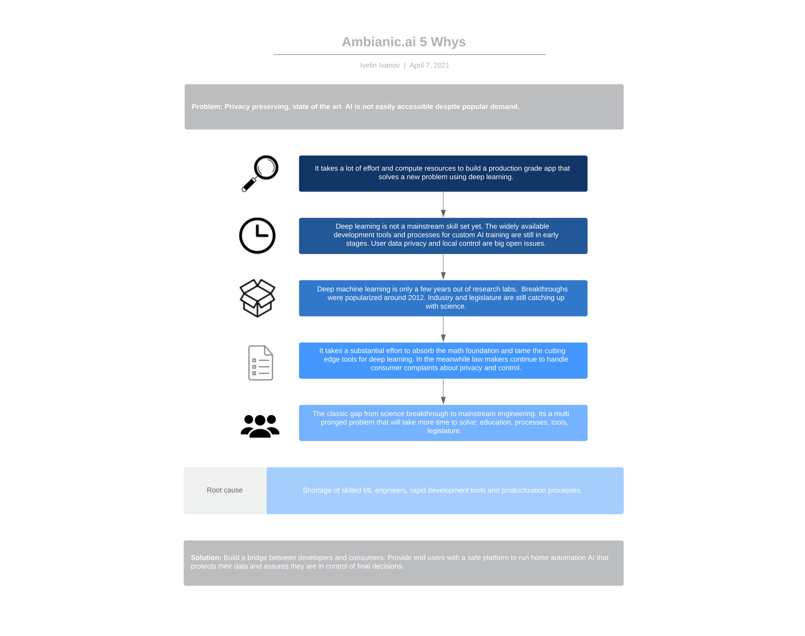

# Helpful AI for Home and Business Automation

Ambianic's mission is to make our homes and workspaces a little cozier by providing helpful and actionable suggestions. Ambianic is an Open Source Ambient Intelligence platform that puts local control and privacy first. It enables users to train and share custom AI models without compromising privacy.

[View on Github](https://github.com/ambianic/ambianic-core)

## The 5 Whys

What's the root cause for Ambianic.ai to exist? Below is a
[5 Whys](https://en.wikipedia.org/wiki/Five_whys) diagram that
tries to provide objective answers:

Needless to say there are
subjective reasons which are equally if not more influential for the existence
of this project such as basic human excitement to serve a bigger purpose
via open source AI.

## User Journey

Ambianic's roadmap is inspired by user stories and community feedback.
The following diagram illustrates an example user journey.

User journeys help us align on the bigger picture and segue into
agile development constructs such as user stories and sprints.
More user journeys will be added over time as the project evolves. Some of the
candidate topics include:

- **Home Automation**
    - Turn traditional door locks into smart locks with Face Recognition.
    - Alert parents if a crying toddler is left unattended for more than 15 minutes.
    - Raise an alert if a baby is seated near a car door without child lock enabled while in motion.

- **Business Automation**
    - Prevent accidents by alerting drivers who act sleepy or distracted.
    - Make sure that a factory floor position is not left unattended for more than 15 minutes.
    - Recognize presence of unauthorized people in a restricted access work area.

## User - System Interactions

Users interact with the system in two phases:

1. First Time Installation
2. Consequent App Engagements

The following diagram illustrates the high level user - system interactions.

## User Interface Flow

The User Interface is centered around three main activities:

1. Setup Ambianic Edge to communicate with smart home devices: sensors, cameras, microphones, lights, door locks, and others.
2. Design flows to automatically observe sensors and make helpful recommendations.
3. Review event timeline, alerts and actionable recommendations.

Ambianic UI is an Offline-First
[PWA](https://en.wikipedia.org/wiki/Progressive_web_applications)
(Progressive Web Application).
PWAs work in any browser, but "app-like" with features such as being
independent of connectivity, install to home screen, and push messaging depend
on browser support.

Ambianic UI does not assume that the user has constant
broadband internet access. Its built to handle a range of real world scenarios
with low bandwidth or no-Internet access at all when the user may need to
 review Ambianic alerts, events timeline, edit flows and configure edge devices.

Ambianic UI stores data locally on the client device (mobile or desktop) and,
when there’s a network connection,
syncs data to the user's Ambianic server and resolves any data conflicts.
When possible it communicates directly with local Ambianic Edge devices
minimizing network routing overhead.

## Product Design Goals

Our goal is to build a product that is useful out of the box:

 - Less than 15 minutes setup time
 - Less than $75 in hardware costs
   + Primary platform: Raspberry Pi 4 B, 4GB RAM, 32GB SDRAM
 - No coding required to get started
 - Decomposable and hackable for open source developers

## Quick Start

If you would like to try the latest version, follow the steps in the [Quick Start Guide](users/quickstart.md).

## Community Support

If you have questions, ideas or cool projects you'd like to share with the Ambianic team and community, please use the [Ambianic Twitter channel](https://twitter.com/ambianicai).

## Contributors
If you are interested in becoming a contributor to the project, please read the [Contributing](legal/CONTRIBUTING.md) page and follow the steps. Looking forward to hearing from you!
