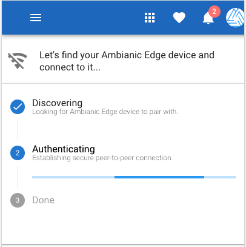
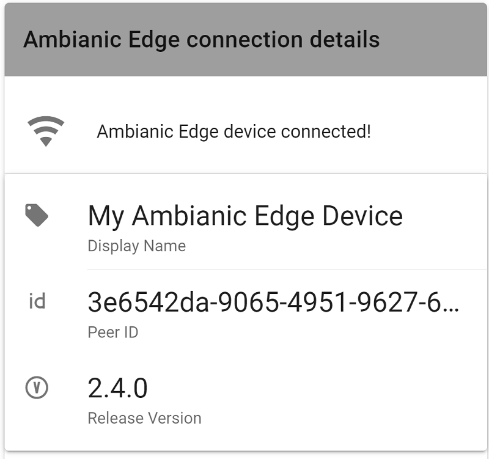
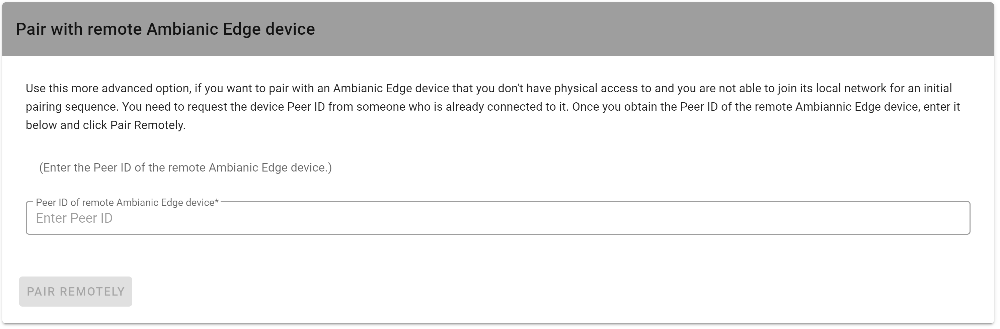

# Establishing initial connection (pairing) between Ambianic UI and Ambianic Edge devices

Upon starting the Ambianic UI (Progressive Web App) for the first time, it will automatically start looking in the background for an Ambianic Edge device on your own local network. If there is an active Edge device on your local network, it will be discovered and the UI will pair with it within a few moments.

If your UI app is *not* connected to the Internet, you will see an indication in the top Nav Bar indicating that.

Once the UI is connected to an Edge device, it will change to:

If you want to connect to an Ambianic Edge device that's not on your local network, you can scroll down to `Pair with Remote Ambianic Edge device` and enter the PeerJS ID you get *from* someone who can connect to that device on *their* local network.

Enter the Peer JS ID in the input field and press `PAIR REMOTELY`. 

Once connected, click on the link `Timeline` to see the Edge Device settings.

If you want to consequently connect to an Edge Device on *your* local network, go back to `Settings` and use `DISCOVER ON LOCAL NETWORK`

This will make sure you get disconnected from the remote Edge device and connect back to your own local network Edge device.

Once the UI app establishes an innitial connection with an Edge Device, the UI app (PWA) saves the Edge unique PeerID in the browser local (mobile or desktop) device storage. From that point forward, the UI can re-connect from any Internet location.
