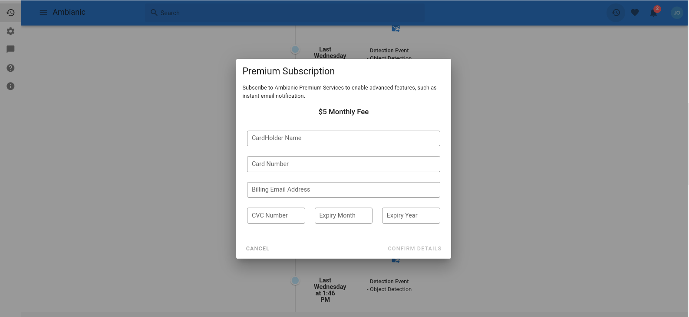

# Ambianic Premium Services

Ambianic Premium Services provides you with more pre-configured value added services, such as the Premium Notification Service that automatically delivers notification to a user on each event detection.    
These Premium Services can be accessed by creating a user account through the [Ambianic PWA](https://github.com/ambianic/ambianic-ui) and adding a subscription to your Ambianic account.
 
 

## User Management
Premium services within Ambianic have been designed to reduce the manual configuration needed to get the best out of the Ambianic software. 
Hence, the need to create a personal account. Through the [Ambianic PWA](https://github.com/ambianic/ambianic-ui), you can sign in to your Ambianic Account from any other device you own.

The following steps below highlight the process needed for creating an account with Ambianic;

- From the [Ambianic PWA](https://github.com/ambianic/ambianic-ui) NavBar, click the <b>UPGRADE TO PREMIUM</b> button to navigate to the authentication page where you provide your Name, Email and Password details to either create a new account or Sign in to an existing account. Existing Social accounts such as a [Google](https://www.google.com/), [Apple](https://www.apple.com/ng/), [Facebook](https://www.facebook.com/) and [GitHub](https://github.com/) can also be used to quickly create an Ambianic Account. 
                                                                                                                    
    

With an account created using the step above, you can now purchase the Ambianic Premium Subscription on your account and manage it through the [Ambianic PWA](https://github.com/ambianic/ambianic-ui).
                        
### User Subscription

Premium services within Ambianic are made available to users with an active subscription.
This subscription which is associated with a user's account, costs a fixed price of <b> $5 dollar</b> and is billed <b> every month </b> on a recurring basis. 

The following steps below highlight the process of purchasing a subscription for your user account using the PWA;

1. From the [Ambianic PWA](https://github.com/ambianic/ambianic-ui) NavBar, click the avatar of the logged-in user to open the user management dropdown modal.

    
   
2. Click the <b>Add Premium Subscription </b> text within the user management dropdown to open the Premium Subscription modal. 
                          

3. Input your credit card details into the appropriate fields within the Premium Subscription modal and confirm the details to purchase the subscription.
                 
You can view all details about your purchased subscription by clicking the user avatar to open the User Management Dropdown modal. 
These details include `Subscription name`, `expiry date`, and `subscription status`.
  

!!! note
    Premium subscriptions would be automatically renewed after expiry, if unsuccessful,
    a <b>Renew</b> button would be provided in the User Management Dropdown, with which you can use to manually renew your subscription.

!!! warning
    Clicking the <b>Cancel</b> button would stop the automatic renewal of an active subscription and delete the subscription from the user's account after it's expiry.     
                                                                                                                                                     
## Premium Notifications

Premium Notifications provides a subscribed user with the feature of receiving notifications about event detections directly from the running edge device, even when not connected to the [Ambianic PWA](https://github.com/ambianic/ambianic-ui).
 
 
Rather than manually configuring this functionality, Premium Notifications automatically configures the connected Edge Device with Ambianic bearing the costs incurred when notifications are sent.   

!!! note
    Currently, notifications are sent via email messages to the subscribed user's email address. 
    However, there are [plans](https://github.com/ambianic/ambianic-subscriptions/issues/15) to also deliver premium notifications via SMS.

 
### Configuring Premium Notifications on Edge Device
The process to configure the Premium Notifications feature is automatically initiated after a successful subscription or after a previously subscribed user is authenticated with their existing Ambianic Account.

!!! warning
    The Edge Device is what is configured by the Ambianic PWA, hence a running Edge Device must be connected before the configuration process can be initiated. 

During the configuration process, the Ambianic PWA displays the Edge Configuration modal as shown below and informs the connected Edge Device where the notifications should be sent to.

  