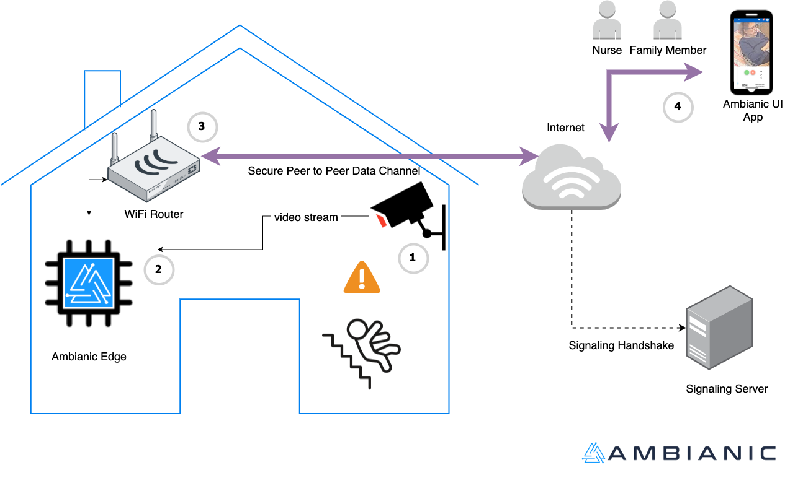
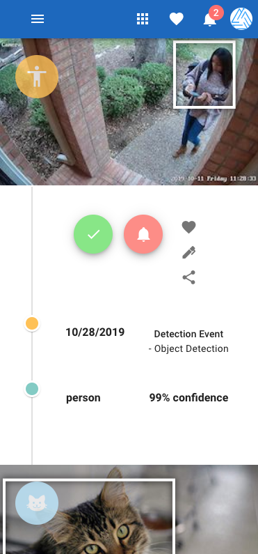
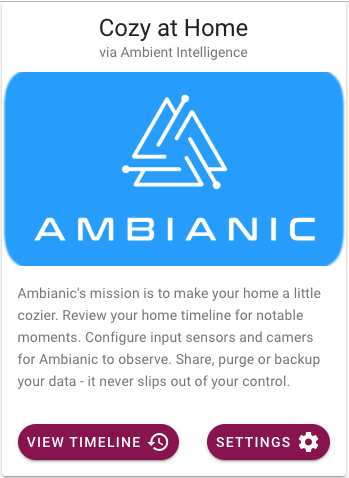

# Quick Start Guide

Ambianic is an [award winning](https://blog.ambianic.ai/2020/11/05/awards.html) ambient intelligence platform. Ambianic's goal is to provide helpful and actionable observations in the context of home and business automation.

Ambianic has two major components: 
- Ambianic Edge: an IoT device with camera (or other sensors) and a built-in AI engine for local inference
- Ambianic UI app - a front-end Progressive Web App to manage Ambianic Edge device(s) and view timeline events reported by Ambianic Edge.

Following is a high level diagram of a typical Ambianic deployment.



## Recommended Install

The simplest way to get started is to follow these steps:

- [Assemble Ambianic Box hardware](ambianicbox.md)
- [Install and run Ambianic software](installsoftware.md)

If you prefer an alternative hosting platform for your Ambianic Edge device, keep reading about more advanced installation options.

## Advanced Install

If you are familiar with Docker you will be able to install Ambianic Edge in less than 5 minutes on almost any computer with x86 or ARM architecture. Follow the steps below:

### Ambanic Edge Docker image

Ambianic Edge is
[available](https://hub.docker.com/r/ambianic/ambianic-edge) as a docker image for ARM and x86 architectures so it can be deployed
on most modern machines and operating systems.

The reference test system is:
[Raspberry Pi 4 with 4GB RAM and 32GB SD card](https://www.raspberrypi.org/products/raspberry-pi-4-model-b/). 
_Although docker images are [available](https://hub.docker.com/r/ambianic/ambianic-edge/tags) for most common ARM and x86 machines._

To deploy on a Raspberry Pi 4, you will need a recent
[Raspbian install](https://www.raspberrypi.org/documentation/setup/) with
[Docker](https://www.freecodecamp.org/news/the-easy-way-to-set-up-docker-on-a-raspberry-pi-7d24ced073ef/)
and [Docker Compose](https://docs.docker.com/compose/) on it. 
You can install and run the image in the default pi user space on Raspbian.

#### Installer for Raspberry OS and Debian-like linux

We have a commodity script that will take care of installing and setting up your system. Run this line to setup 

```sh
wget -qO - https://raw.githubusercontent.com/ambianic/ambianic-quickstart/master/installer.sh | sh
```

After the setup you can find the installation under `/opt/ambianic` where you can find the configuration files and the data directory (under `/opt/ambianic/data`).

Ambianic Pipeline configuration will be under `/etc/ambianic`.

#### The Ambianic Edge CLI

The installer will start the service for you. To manage the runtime you can use the `ambianic` command line. A few examples:

- Start, Stop or Restart with `ambianic [ start | stop | restart ]`
- View the instance status with `ambianic status`
- View logs with `ambianic logs`
- Open the UI (if you system has a GUI) with `ambianic ui`
- Upgrade the installation with `ambianic upgrade`

### Ambianic UI app

[Ambianic UI](https://ui.ambianic.ai/) is a
modern progressive web application (PWA) that provides Plug-and-Play pairing and remote access
to an Ambianic Edge device.

Ambianic UI shows a timeline view with
important events around your home organized chronologically. Below is an example
timeline screenshot.



### Pairing Ambianic UI with Ambianic Edge

You can easily pair up your Ambianic UI with Ambianic Edge. It works similar to Airdrop.

Make sure to open Ambianic UI on the same local network where Ambianic Edge runs. Ambianic UI will initially display a welcome screen.



If you click on Settings, it will show  a pairing page like the one below:


After a few moments, pairing will conclude and you will see the unique identifier of your Ambianic Edge device.


IYou can now head to the Timeline view and you will be able to see an image of what is in front of the Ambianic Box. The box is pre-configured to detect people and over 20 kinds of objects. Detections will show in your timeline.

Congratulations! Your Ambianic instance is now up and running!

The pairing information is persisted on your Ambianic UI client device and you can now access Ambianic Edge from anywhere remotely! The connection is direct and encrypted end-to-end.

When you are ready to explore more advanced capabilities, continue to the next section.

### Ambianic Premium Services

Ambianic provides premium value added services such as email notifications for users who prefer the convenience of automatic integration with third party cloud services.

Read on: [Using Ambianic Premium Services](premium-services.md)

### Configuration

Ambianic provides flexible configuration options via a configuration YAML file. You can customize: pipelines, input sources, AI models, notification channels and more.

Read on: [Configuring Ambianic Edge](configure.md).


## Development

If you want to contribute to the code read how to [setup a development environment](../developers/development-environment.md)

## Troubleshooting

If you experience problems with your initial setup and you can't find a good solution online, feel free to engage the team on [Twitter](https://twitter.com/ambianicai), [Slack](https://ambianicai.slack.com/join/shared_invite/zt-eosk4tv5-~GR3Sm7ccGbv1R7IEpk7OQ#/), or [Github discussion forums](https://github.com/ambianic/ambianic-ui/discussions).

## Supporting the project

If you find value in this project, consider supporting its future success. See the [sustainability](https://docs.ambianic.ai/#sustainability) section.
 
